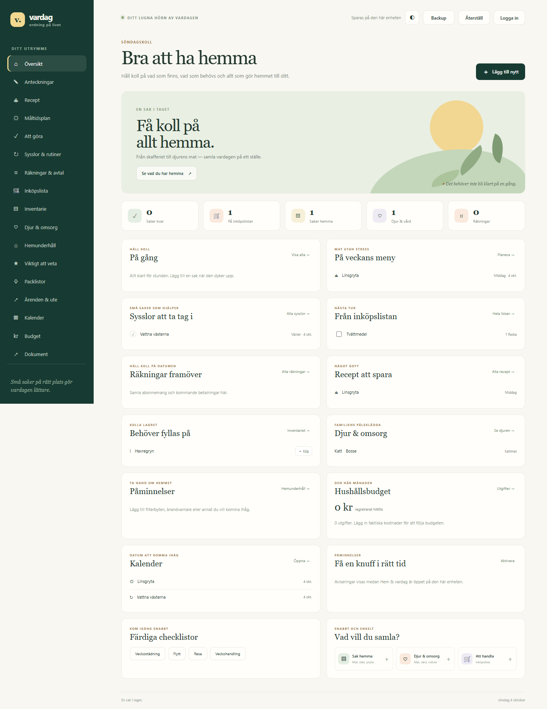
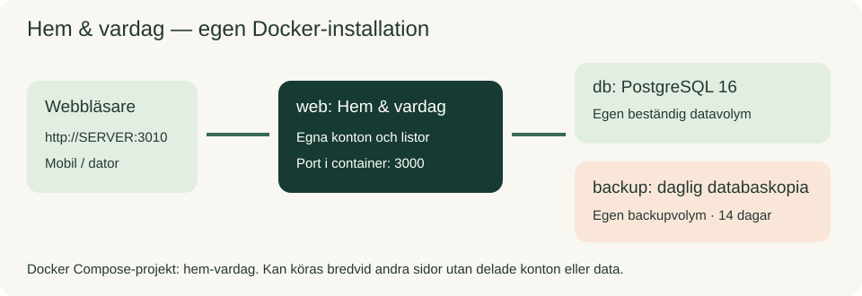
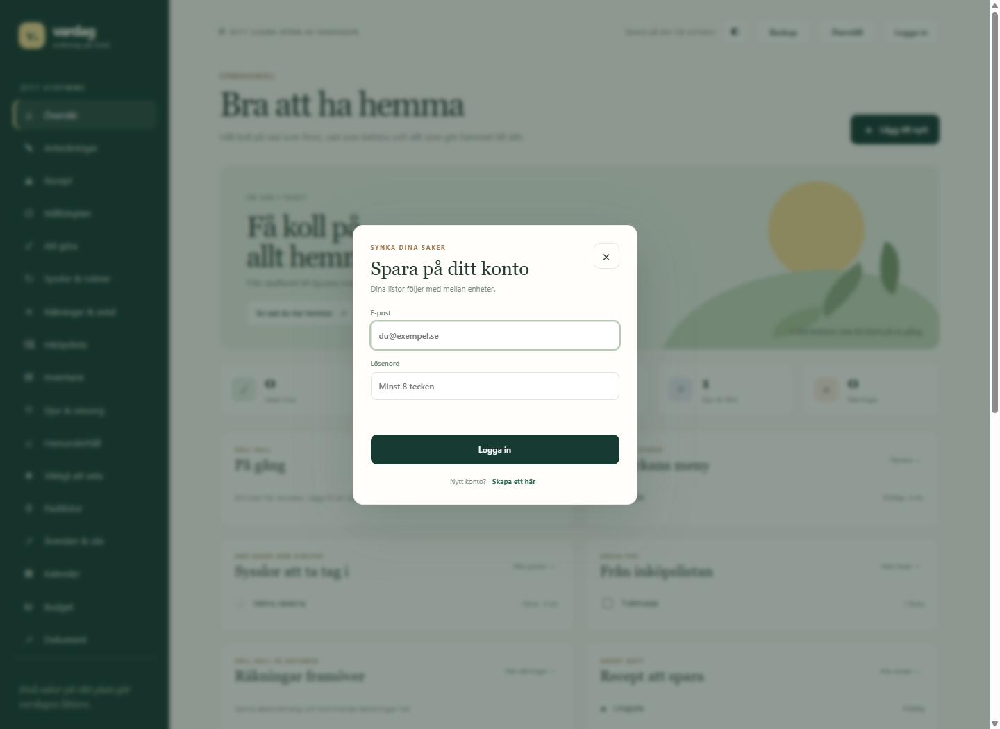
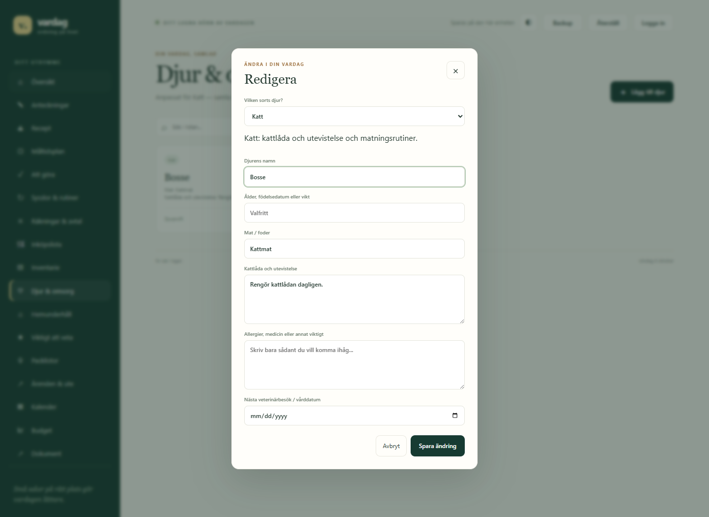

# Hem & vardag

En fristående svensk hemsida för livet hemma: recept, anteckningar, sysslor, inköp, inventarie, djur och viktiga saker att komma ihåg. **Det här projektet innehåller inte träningssidan Formkurva.** Det har egen server, egna konton och egen databas.



## Vad finns på sidan?

- Anteckningar, recept med ingredienser och måltidsplanering.
- Att göra, återkommande sysslor, hemunderhåll, packlistor och ärenden.
- Inköpslistor och inventarie för mat, städ, badrum, verktyg och förråd.
- Mängd hemma, påfyllningsnivå och bäst före; lägg till inköp eller planera att använda mat snart.
- Djurprofiler för hund, katt, kanin, fågel, fisk, reptil, gnagare, häst och eget djurslag.
- Räkningar, registrerade utgifter och månadssummering.
- Kalender över daterade poster, dokumentlänkar och checklistmallar.
- Egna användarkonton och delat hushåll för upp till 10 personer via inbjudningskod.
- Kontoinbjudningar, manuella roller, inaktivering, sessionshantering och administrativ aktivitetslogg.
- Tvåstegsverifiering med autentiseringsapp och engångsåterställningskoder; obligatorisk för administratörer.
- JSON-backup och återställning av listor.

Gäster sparar lokalt på sin enhet. Inloggade användare sparar i PostgreSQL. Listorna blir bara gemensamma om man går med i samma hushåll; då delas **alla hushållslistor**, även anteckningar, dokumentlänkar och utgifter. Sidan kontrollerar versionen vid sparande så att gamla kopior inte skriver över nyare ändringar. Vid konflikt: ta Backup, ladda om och återställ de poster du vill behålla.

Påminnelser är webbläsaraviseringar, inte pushnotiser när sidan är stängd. De kräver att sidan är öppen, att webbläsaren stöder funktionen och normalt HTTPS (eller localhost). Dokumentdelen lagrar länkar och anteckningar, inte filer. Budgeten är en enkel utgiftsöversikt, inte bankkoppling eller bokföring.

## Vad behöver jag?

| Krav | Rekommendation |
|---|---|
| Server | Debian 12/13 eller Ubuntu 22.04/24.04; även Raspberry Pi 4/5 (64-bit), VM eller Proxmox-LXC |
| Minne | Minst 1 GB, helst 2 GB |
| Disk | Minst 5 GB ledigt samt utrymme för databas och backup |
| Program | Docker Engine, Docker Compose v2, Git och curl |
| Nätverk | Ledig port **3010**; internet vid installation och uppdatering |
| Klient | Mobil, surfplatta eller dator med modern webbläsare |

I Proxmox-LXC behöver Docker-stöd vara konfigurerat, vanligtvis `nesting` och `keyctl`. En VM är enklare om du är osäker. Ingen domän behövs hemma. För internetåtkomst rekommenderas HTTPS och en reverse proxy.



En Docker Compose-installation startar tre containrar: **web** (sidan och kontona), **db** (PostgreSQL) och **backup** (daglig databasbackup). Databasen exponeras inte på någon port på servern. Projektet använder namnet `hem-vardag` och egna volymer, så Formkurva kan fortsätta köras separat på port 3000.

## Snabbinstallation på Debian/Ubuntu

Kör på servern via SSH. Om git/curl saknas:

```bash
sudo apt update
sudo apt install -y git curl ca-certificates
```

Ladda ned och kör installationsskriptet:

```bash
curl -fsSL https://raw.githubusercontent.com/richardstenlund/hem-vardag/main/install.sh -o /tmp/install-hem-vardag.sh
sudo bash /tmp/install-hem-vardag.sh
```

Skriptet installerar Docker om det saknas, klonar till `/opt/hem-vardag`, skapar `.env` med slumpade lösenord, bygger och startar sidan. **Det skriver inte över en befintlig `.env`.** Slutligen visas webbaddress, admin-e-post och lösenord. Spara dessa privat.

Öppna **`http://SERVERNS-IP:3010`**. Hitta serverns IP med `hostname -I`. Du behöver inte lägga till något filnamn efter adressen.

Valfri port och installationsmapp:

```bash
sudo env APP_PORT=3020 HEM_VARDAG_DIR=/opt/hem-vardag bash /tmp/install-hem-vardag.sh
```

Den egna porten används vid en ny installation. Vid uppdatering läses porten ur befintlig `.env`.

## Manuell Docker-installation

Docker och Compose v2 måste redan vara installerade. Kontrollera med `docker --version` och `docker compose version`.

```bash
git clone https://github.com/richardstenlund/hem-vardag.git
cd hem-vardag
cp .env.example .env
nano .env
```

Fyll i:

- `ADMIN_EMAIL`: administratörens e-postadress.
- `ADMIN_PASSWORD`: ett unikt lösenord med minst 12 tecken.
- `DB_PASSWORD`: ett annat långt, slumpat lösenord.
- `APP_URL`: exempelvis `http://192.168.1.50:3010`, med din servers adress.

Spara med Ctrl+O, Enter och avsluta med Ctrl+X. Starta:

```bash
docker compose up -d --build
docker compose ps
curl --fail http://localhost:3010/api/health
```

Hälsokontrollen ska svara med `"ok":true` och `"application":"hem-vardag"`. Öppna sedan `http://SERVERNS-IP:3010` i webbläsaren.

> **Viktigt:** använd en ny projektmapp och en egen `.env`, inte Formkurvas filer eller databasvolym. Radera inte Formkurvas volymer. Konton och data flyttas inte automatiskt mellan projekten.

## Konton och första inloggningen

1. Öppna sidan via serveradressen, **inte genom att dubbelklicka på HTML-filen**.
2. Tryck **Logga in** och använd admin-uppgifterna från `.env` eller installationsskriptet.
3. Välj **Byt lösenord** i menyn och sätt ett eget lösenord. På mobil finns länken i toppfältet.
4. Öppna **Kontosäkerhet**, skapa en autentiseringsnyckel med ditt nuvarande lösenord, skanna QR-koden med en autentiseringsapp och bekräfta appkoden. **Spara återställningskoderna privat innan du lämnar sidan.** Administratörer måste aktivera detta innan de kan administrera konton.
5. Öppna **Administrera konton**, skapa en inbjudan till personens e-post och skicka länken privat. Personen öppnar länken och registrerar sitt eget konto.
6. För gemensamma listor: välj **Dela hushåll**, skapa ett hushåll och dela koden. De andra loggar in och väljer **Gå med** med koden.
7. Administratören kan återställa glömda lösenord. Inga hushållslistor visas i adminpanelen. Lösenordsåterställning stänger kontots inloggningar men tar inte bort tvåstegsverifieringen.
8. **Manuella roller är standard.** Befintliga konton behåller sina roller och nya konton blir vanliga användare. Välj **Gör till administratör** eller **Gör till användare** och bekräfta. Minst en aktiv administratör måste finnas kvar. Roller gäller direkt; en ny administratör måste aktivera tvåstegsverifiering för att få tillgång till kontohanteringen.
9. Använd helst **Inaktivera konto** när någon inte längre ska ha åtkomst. Alla sessioner avslutas och nya inloggningar blockeras, men kontot och listorna behålls. **Aktivera konto** tillåter inloggning igen. Hushållsmedlemskap behålls; övriga medlemmar kan fortsätta använda de delade listorna. Den sista aktiva administratören kan inte inaktiveras, tas bort eller nedgraderas.
10. **Ta bort användare** raderar kontot, dess privata listor och alla inloggningar permanent. Ta först en databasbackup. Delade listor behålls när en medlem tas bort. Äger kontot ett hushåll måste du först välja en annan medlem och **Överför ägarskap**. Om hushållet saknar andra medlemmar behöver ägaren bjuda in någon först. Kontot i `ADMIN_EMAIL` är skyddat eftersom det annars återskapas vid omstart; byt inställningen till en annan administratör före borttagning.

**Uppgradering från läget där alla var administratörer:** sätt `ALL_USERS_ADMIN=false` i `.env` och kör `docker compose up -d --build`. Tidigare administratörer behåller rollen tills du ändrar den i kontohanteringen. `ALL_USERS_ADMIN=true` går fortfarande att aktivera, men då får alla konton administratörsbehörighet och manuella rolländringar stängs av. Med öppen registrering kan vem som helst som når sidan då ta över andra konton genom att återställa deras lösenord.

| Logga in eller skapa konto | Anpassad djurprofil |
|---|---|
|  |  |

Admin-kontot skapas vid start om e-postadressen inte finns. En omstart ändrar **inte** ett befintligt kontos lösenord. Ingen e-postserver behövs; automatisk lösenordsåterställning via e-post ingår inte.

### Inbjudningar och registrering

`INVITE_ONLY=true` är standard, även för installationer där variabeln saknas. En kontoinbjudan är bunden till e-postadressen, gäller i 7 dagar och fungerar en gång. Ny inbjudan till samma adress återkallar tidigare oanvända länkar. Administratörer kan återkalla länkar manuellt. Servern lagrar bara en hash av inbjudningskoden; länken visas en gång och skickas inte automatiskt via e-post.

Kontoinbjudan och hushållets delningskod är **olika saker**: kontoinbjudan skapar ett konto; hushållskoden delar listor. Ingen ansluts automatiskt till ett hushåll.

Låt inbjudningsregistrering vara på när du vill bjuda in: `ALLOW_REGISTRATION=true` och `INVITE_ONLY=true`. `ALLOW_REGISTRATION=false` stänger **all** registrering, även giltiga inbjudningar. `INVITE_ONLY=false` öppnar registreringen för alla som når sidan och rekommenderas inte för internetåtkomst.

### Tvåstegsverifiering och inloggningar

- Välj **Kontosäkerhet** på startsidan. Administratörer måste använda tvåstegsverifiering; övriga kan aktivera den frivilligt.
- QR-koder genereras lokalt på servern, utan extern QR-tjänst. Nyckeln visas bara under aktiveringen. Bekräfta inom 10 minuter.
- Vid inloggning: ange först e-post och lösenord, sedan appkod eller återställningskod. En appkod kan inte återanvändas; vänta på nästa kod om du nyss använt den. Serverns och telefonens klockor måste vara rätt.
- Varje återställningskod fungerar en gång. **Skapa nya återställningskoder** kräver lösenord och appkod eller befintlig återställningskod och gör alla gamla koder ogiltiga. Ladda ned eller skriv ned dem och förvara separat från telefonen.
- Om telefonen försvinner: logga in med en återställningskod. Under **Kontosäkerhet** väljer du **Byt autentiseringsapp eller nyckel** och anger lösenord samt en annan återställningskod. Skanna den nya QR-koden, bekräfta och spara de nya återställningskoderna. Den gamla appen fungerar tills den nya är bekräftad; därefter ersätts nyckeln och andra inloggningar avslutas. Administratörer kan byta app men inte stänga av tvåstegsverifieringen.
- Om både appen och samtliga återställningskoder är förlorade krävs hjälp av den som administrerar servern; det finns ingen osäker automatisk förbikoppling via lösenordsåterställning. Ha gärna två administratörer och en säker backup.
- Aktivering avslutar andra inloggningar. Äldre sessioner som saknar verifiering måste bekräftas under **Kontosäkerhet**.
- **Dina inloggningar** visar webbläsare, skapandetid och giltighetstid. Avsluta en inloggning, logga ut här eller välj **Logga ut alla andra enheter**. Inloggningstokens visas aldrig.

### Administrativ aktivitetslogg

Adminpanelen visar aktör, berört konto, tid och åtgärd för rolländringar, lösenordsåterställning, aktivering/inaktivering, borttagning, ägaröverföring, inbjudningar och ändringar av tvåstegsverifiering. **Visa äldre händelser** hämtar 50 åt gången. Loggen innehåller aldrig lösenord, säkerhetsnycklar, koder eller listinnehåll. Händelser behålls även efter att ett konto tagits bort; tänk på att e-postadresser därmed finns kvar i den administrativa loggen. Detta är ingen manipulationssäker extern revisionslogg.

### Rekommenderad användarhantering

Ge varje person ett eget konto. Ha en huvudadministratör och en reserv, och ge övriga användarrollen. Hushållsägaren behöver inte vara administratör för hela sidan. Inaktivera hellre än att radera direkt, ta backup före borttagning och använd HTTPS vid åtkomst utanför hemmet. Ge bara administratörsbehörighet till personer du litar på.

## Inställningar

| Variabel i `.env` | Betydelse |
|---|---|
| `APP_PORT` | Port på servern; standard 3010. Ändra om upptagen |
| `APP_URL` | Adressen användarna öppnar; ska stämma med HTTP/HTTPS och port |
| `ADMIN_EMAIL`, `ADMIN_PASSWORD` | Admin som skapas om kontot saknas; lösenord minst 12 tecken |
| `DB_NAME`, `DB_USER`, `DB_PASSWORD` | Egna databasuppgifter. Byt inte efter installation utan databasadministration |
| `SECURE_COOKIES` | `false` för HTTP hemma, `true` bakom HTTPS |
| `ALLOW_REGISTRATION` | `true` låter användare skapa konton; `false` stänger registreringen |
| `ALL_USERS_ADMIN` | Standard `false`: manuella roller, nya konton blir användare. `true` gör alla konton till administratörer vid start och registrering |
| `INVITE_ONLY` | Standard `true`: registrering kräver kontoinbjudan. `false` öppnar registreringen |
| `SESSION_DAYS` | Hur länge inloggningen gäller; standard 30 dagar |

Efter ändring: `docker compose up -d`. Lägg aldrig `.env` eller databasbackuper på GitHub.

## Uppdatera

```bash
cd /opt/hem-vardag
bash update.sh
```

Skriptet tar en databasbackup före uppdateringen, hämtar senaste koden och bygger om containrarna. Eller manuellt:

```bash
git pull --ff-only
docker compose up -d --build
```

Listor och konton ligger kvar i databasvolymen. Kontosäkerhetens tabeller och kolumner läggs till automatiskt vid start; befintliga roller, lösenord och hushåll bevaras. Befintliga administratörer behöver aktivera tvåstegsverifiering innan de kan öppna adminpanelen. Sätt `ALL_USERS_ADMIN=false`, `INVITE_ONLY=true` och `ALLOW_REGISTRATION=true` i `.env` för manuella roller och inbjudningsregistrering. Stoppa med `docker compose down`. **Använd inte `docker compose down -v`** om du vill behålla databasen och backuperna.

## Säkerhetskopiering

**Backup** på sidan laddar ned aktuella hushållslistor som JSON. **Återställ** slår ihop en sådan kopia med befintliga listor. Det är inte en backup av alla användarkonton.

Containern `backup` tar en databasbackup vid start och sedan varje dygn; äldre än 14 dagar rensas. Backuperna ligger på samma server och bör kopieras till en annan enhet. Kontrollera att tjänsten fungerar med `docker compose logs backup`.

Databasbackuper innehåller konton, listor, aktivitetslogg och autentiseringsappens hemliga nycklar. Skydda dem lika noga som lösenord, använd krypterad lagring utanför servern och ladda aldrig upp dem till GitHub.

Manuell fullständig databasbackup:

```bash
docker compose exec -T db sh -ec 'pg_dump -U "$POSTGRES_USER" -d "$POSTGRES_DB" -Fc' > hem-vardag.dump
```

Återställning **ersätter nuvarande databasdata**. Ta först en ny backup och stoppa webbapp och automatisk backup:

```bash
docker compose stop web backup
docker compose exec -T db sh -ec 'pg_restore --clean --if-exists --no-owner -U "$POSTGRES_USER" -d "$POSTGRES_DB"' < hem-vardag.dump
docker compose start web backup
```

## HTTPS och brandvägg

Hemma kan sidan öppnas via HTTP. Om du använder `ufw`: `sudo ufw allow 3010/tcp`. Använd helst VPN för fjärråtkomst. För publicering på internet används HTTPS framför port 3010, exempelvis med Caddy (se [Caddyfile.example](Caddyfile.example)). Sätt `APP_URL=https://din-domän` och `SECURE_COOKIES=true`. Begränsa registrering om sidan inte ska vara öppen för alla.

## Om sidan inte fungerar

```bash
cd /opt/hem-vardag
docker compose ps
docker compose logs --tail=100 web db
curl --fail http://localhost:3010/api/health
```

- **Porten upptagen:** ändra `APP_PORT` och `APP_URL` i `.env`, starta igen.
- **Databasen startar inte:** kontrollera DB-uppgifterna och loggen. Ändrat `DB_PASSWORD` i `.env` ändrar inte automatiskt lösenordet i en befintlig volym.
- **Inloggning fungerar inte över HTTP:** `SECURE_COOKIES` ska vara `false`.
- **Sidan öppnas som `file:///...`:** konton fungerar inte där. Använd Docker-serveradressen.
- **Synkkonflikt:** ta JSON-backup av ändringarna, ladda om sidan och återställ vid behov. Automatisk synk skriver inte över osparade ändringar.
- **Aviseringar saknas:** kontrollera webbläsarens tillåtelse och använd HTTPS; sidan behöver vara öppen.

## Utveckling och tester

Node.js 22 och PostgreSQL 16 rekommenderas. Med PostgreSQL tillgänglig:

```bash
npm ci
DB_HOST=localhost DB_USER=hemvardag DB_NAME=hemvardag DB_PASSWORD=ditt-lösenord npm start
```

API-tester använder en PostgreSQL-kompatibel testdatabas i minnet (`pg-mem`):

```bash
npm ci
npm test
```

Testdatabasen ersätter inte ett riktigt Docker/PostgreSQL-test inför driftsättning.

På en separat testinstallation kan Docker/PostgreSQL-flödet kontrolleras med:

```bash
docker compose exec -T web node < tests/docker-smoke.js
docker compose restart web
# Vänta tills /api/health svarar igen.
docker compose exec -T -e VERIFY_RESTART=true web node < tests/docker-smoke.js
```

Skriptet skapar testkonton och listor. Kör det bara i en testinstallation, inte i ditt riktiga hushåll. Automatisk GitHub Actions-körning ingår inte.
